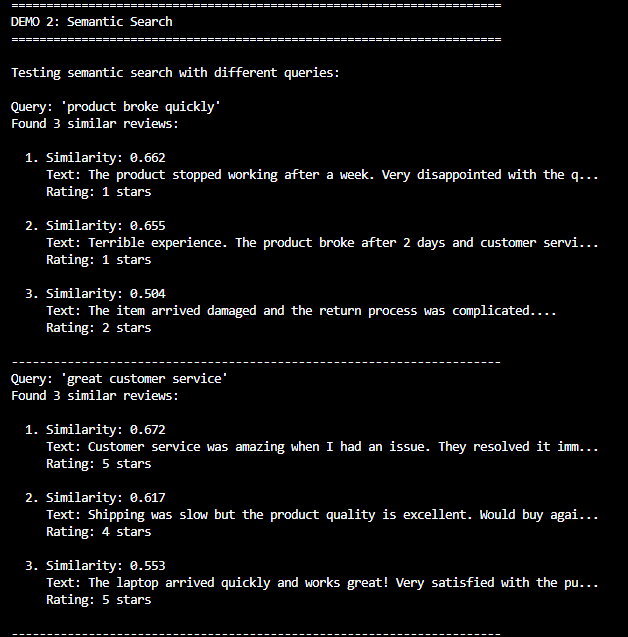
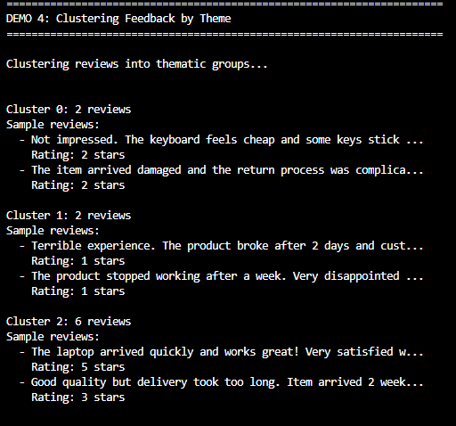
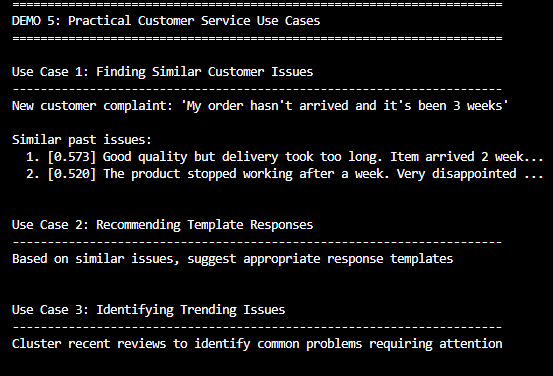

#1. Basic customer service Bot : [basic cs bot] (https://github.com/96jhasuraj/AI/blob/main/RAG/customer_service_bot.py)

issues : intent is not used appropriately . No token limit techiniques applied. Will read more & upgrade

#2. semantic_search_and_automation[https://github.com/96jhasuraj/AI/blob/main/RAG/semantic_search_and_automation.py]

issues : Pretty basic & naive implementation. O(n^2) operations over billion docs wont scale. ANN algos like HNSW have to be implemented. Will read more about ANN & upgrade

