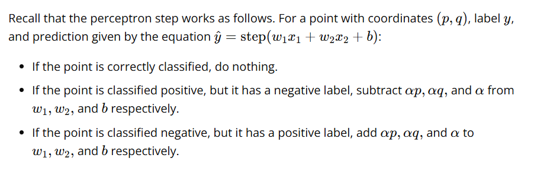
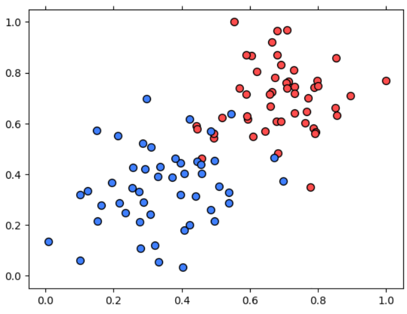
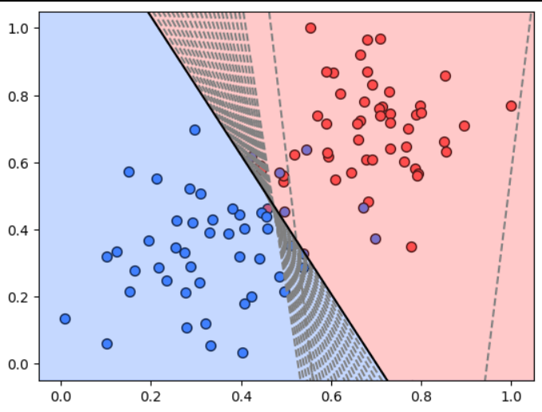

# data :

# learning :

# algo

for all inputs:
    1. get prediction 
    2. no action if correct
    3. The Error Correction Logic: The goal of the update is to make the "score" ($w \cdot x + b$) higher for positive samples and lower for negative samples.
